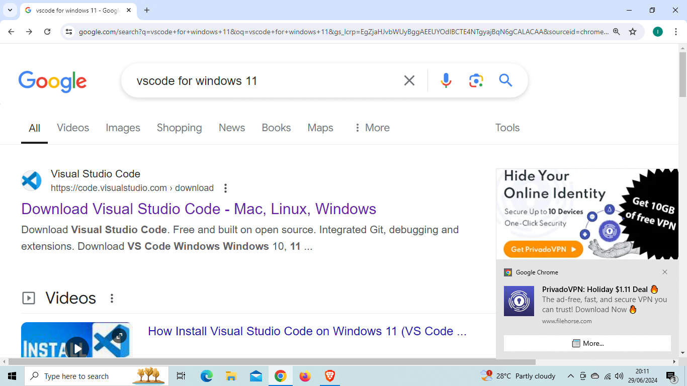
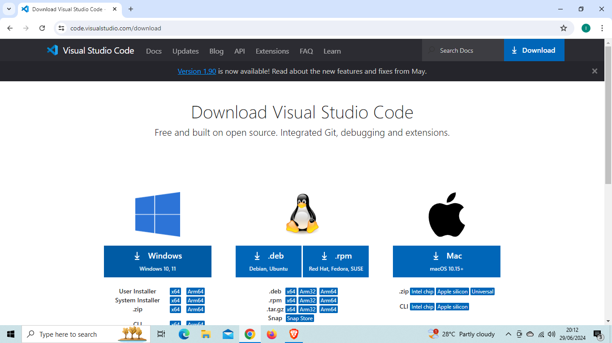
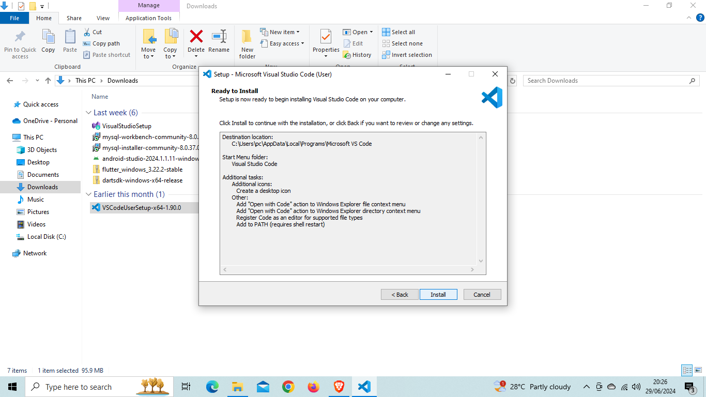
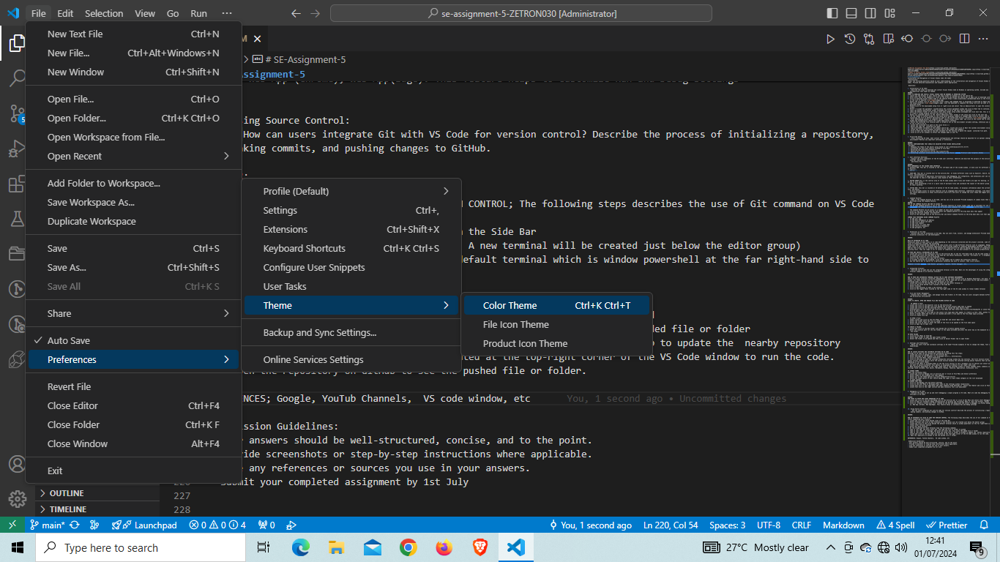
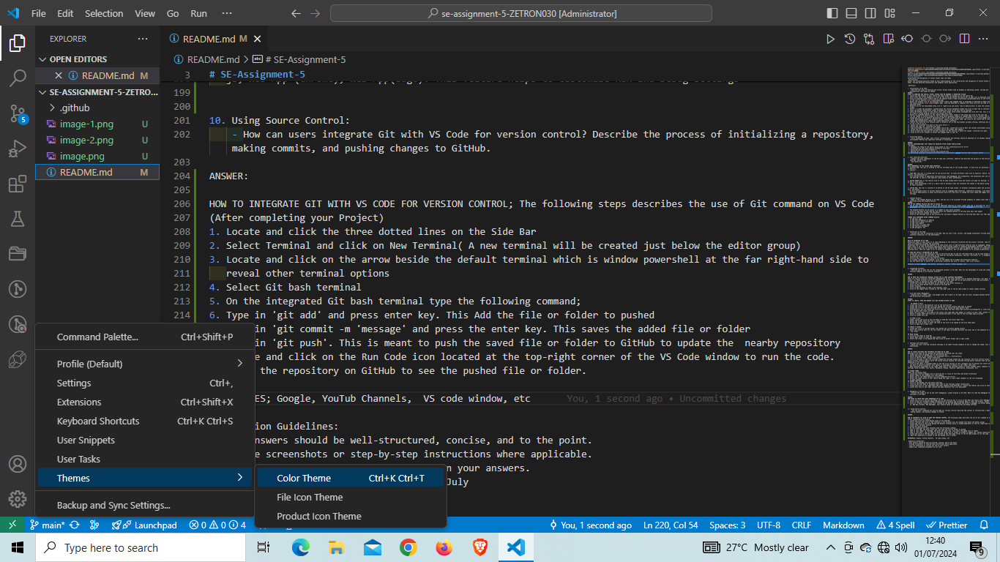
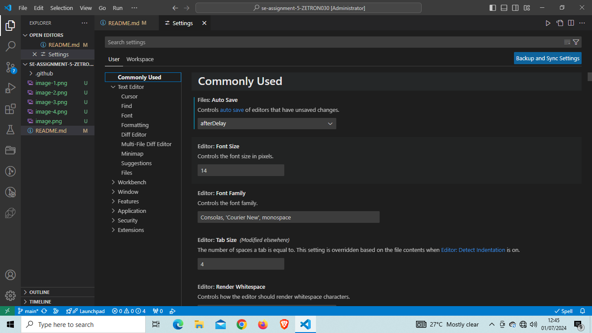
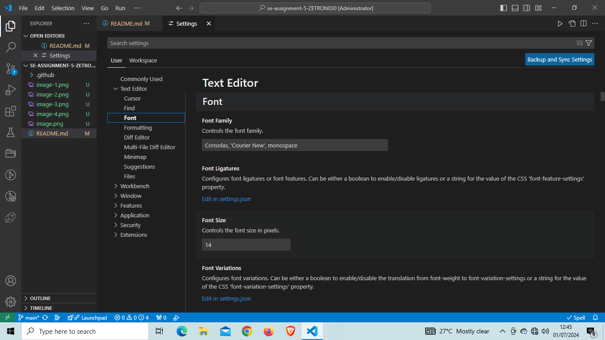

# SE-Assignment-5
Installation and Navigation of Visual Studio Code (VS Code)
 Instructions:
Answer the following questions based on your understanding of the installation and navigation of Visual Studio Code (VS Code). Provide detailed explanations and examples where appropriate.

 Questions:

1. Installation of VS Code:
   - Describe the steps to download and install Visual Studio Code on Windows 11 operating system. Include any prerequisites that might be needed.
ANSWER:
STEPS TO DOWNLOAD AND INSTALL VISUAL STUDIO CODE ON WINDOWS 11 OPERATING SYSTEM
1. Launch any web browser of your choice and type vscode for windows 11 on the search bar
2. press enter key on the keyboard or click on the arrow key beside the search bar to open list of download site.
3. Click on Download Visual studio Code or the website https://code.visualstudio.com>download which is the first option 
   in the list of website.
4. Select the windows icon on the download visual studio code webpage that is displayed to download to begin downloading
   the setup installer.. once the download is complete the setup file will be seen in the download folder.
5. Double-click on the downloaded setup file or right-click and select 'Run as Administrator to open the installer   
   window.
6. Select 'I accept the agreement' located below the License agreement window and click on Next tab to continue.
7. Leave the default destination folder unchanged and click on the next tab to continue.
8. Leave the default folder of the select start menu folder setup window unchanged and click next tab. this is expected 
   to create a vscode program shortcut the system start menu.
9. Select all unmarked options on the 'Select Additional Task' window of the setup and click on the next tab.
10. On the 'Ready to install'window of the setup which displays summary of changes made click on install tab to begin
   installing the file to default destination path of the system hard drive/c: directory.
11. After downloading process is complete select 'Launch Visual Studio Code' and click on the finish tab to close setup 
   window and automatically launch the vscode application software.
12. Ensure the installed file location path is properly set on the environment variable setting, otherwise you will have  
   to set it and to do so.
13. Locate the installed file path on the local drive c:/
14. Select and copy the  installed file path.
15. type environment variables on the windows search bar, locate and click on Edit the systems environment variables.
16. Locate and click on environment variables tab on the window that appears.
17. Click on Edit and then New on the User variable for PCs section to paste the copied  installed file path.
18. Click on ok on all windows to effect the changes made on your PC.

2. First-time Setup:
   - After installing VS Code, what initial configurations and settings should be adjusted for an optimal coding environment? Mention any important settings or extensions.

ANSWER:
INITIAL CONFIGURATIONS THAT SHOULD BE ADJUSTED AFTER VSCODE INSTALLATION
 Includes;
 1. Changing the Theme of the editor group based on user preferences(Ctrl+K ctrl+T)
 2. Activating the Auto Save feature located on file menu
 3. Selecting new terminal(Ctrl+Shift+')
 4. Opening new folders(Ctrl+k Ctrl+O) and files(Ctrl+O)
 5. Installing necessary extensions(Ctrl+Shift+X)e.g Code Runner,Pylance,Prettier-code formatter,Python

3. User Interface Overview:
   - Explain the main components of the VS Code user interface. Identify and describe the purpose of the Activity Bar, Side Bar, Editor Group,  
     and Status Bar.

ANSWER:
MAIN COMPONENTS OF THE VSCODE USER INTERFACE
1. ACTIVITY BAR: This bar is located on the far lef-hand side of the vscode window. it hold icon for different views such as Explorer, 
   Search,   
   source control, and Extensions. it provides quick access to these different functionalities, allowing users to navigate between them easily.

2. SIDE BAR: This bar is located next to the Activity Bar. It holds different views such as Explorer, Search, Source Control, and Extensions.It 
   also provide access to additional functionalities like debugging, Git integration, and extensions.user can customize the Side Bar to show or hide specific views based on their preferences.

3. EDITOR GROUP:This is the central area of the VS Code window where files and folders are open for editing. it consist of one or more editor 
   panes, each displaying a file or a split view of multiple files and customize the layout of the editor group according to their workflow.

4. STATUS BAR: This bar is located at th bottom of the VS Code window. It displays information about the current project, file, and editor. 
   It also provides access to various features such as language mood selection, indentation settings, line endings, and Git status.Additionally it shows notifications and errors and users to change the color theme and toggle various settings.     

4. Command Palette:
   - What is the Command Palette in VS Code, and how can it be accessed? Provide examples of common tasks that can be performed using the Command Palette.
ANSWER:
USE OF THE COMMAND PALETTE AND HOW TO ACCESS IT
   The VS Code Command Palette is one of the important features of visual studio code and is available for use in GitHub Codespaces.The command palette allows you to access many commands for GitHub Codespaces and VS Code.
   
   The Command Palette can be access in a number of ways which includes;
1. Click on view menu on the side bar and select the command palette on the drop down menu that appear
2. Using the shortcut command 'Ctrl+Shift+P
3. Click on the settings icon on the Activity Bar and Select Command Palette on the drop down menu list that appear

COMMON TASK PERFORMED USING COMMAND PALETTE
1. To add cell tag
2. To add Data Breakpoint at Address
3. To add cursors below and above
4. To add line comment
5. To add cursor to lines ends
6. To add Function Breakpoint
7. To add gitignore, etc

5. Extensions in VS Code:
   - Discuss the role of extensions in VS Code. How can users find, install, and manage extensions? Provide examples of essential extensions for web development.

ANSWER:

ROLE OF EXTENSION IN VS CODE
Extensions plays so many roles in vs code depending on the extension installed and the project involved. some of the roles of extensions includes the following;
Extensions when installed and enabled in VS code allows users to add different features such as Languages, Debuggers, and other tools to VS code installation application which provide support or enhances development workflow. They are simply Add-ons that allows you to customize and enhance your experience in VS code by adding new features or integrating existing tools. They can range in all of levels of complexity, but its main purpose is to increase productivity.

TO FIND AND INSTALL EXTENSIONS ON VS CODE
1. Locate and click on the extensions icon on the Activity Bar on the far left-hand side of the VS code window or you use 
   or Locate and click the View Menu on the Side bar and Select Extensions. Shortcut 'Ctrl+Shift +X'. A dropdown list of uninstalled extensions will be displayed.
2. Click on the install tab on each one to install.
3. if already installed but disabled, click on the enable tab to enable the extensions features
4. Use the search bar to search for a particular extension you wish to install, then click install.

Examples includes;Pylance, Code Runner, gitignore, Jupyter, Python debugger, etc.

6. Integrated Terminal:
   - Describe how to open and use the integrated terminal in VS Code. What are the advantages of using the integrated terminal compared to an external terminal?

ANSWER:

HOW TO OPEN AND INTEGRATED TERMINAL WITHIN THE VS CODE SOFTWARE ENVIRONMENT
There are various terminals installed independently on our local machine such as Windows Powershell, Git bash, Command Prompt, etc These terminal are also integrated into the VS Code and can be used within the VS code environment. The following steps is applied to open these terminals on VS code;
1. Locate and click on the View Menu on the Side bar and select Terminal or
2. Click on the three dotted lines located on the Side Bar 
3. Select terminal
4. Click on New terminal to open a new terminal, Also,
5. Click on the Toggle Panel located on the Top-right side of the VS code window to reveal hidden terminal

7. File and Folder Management:
   - Explain how to create, open, and manage files and folders in VS Code. How can users navigate between different files and directories efficiently?

ANSWER:
STEPS TO CREATE, OPEN AND MANAGE FILS AND FOLDERS WITHIN VS CODE

    TO CREATE A FILE:
1. Locate and click on the Explorer icon on the Activity Bar 
2. Locate and click on the New file icon beside the current project name that is opened
3. Locate and click on the New Untitled Text File icon beside the Open Editors Pane
4. Alternatively, you can Locate and click on File Menu and then select New File(Ctrl+Alt+Window+N) or select New Text 
   File to open text files( Ctrl+N)
5. Enter the file type or file name on the select file type pane that appear to create e.g text, html, python file types
6. Select a folder where the file will be located and enter a file name on the File Name space provided
7. Click on Create File tab

   TO OPEN A FILE: 
1. Simply locate and click on the File Menu on Side Bar and select Open file.
2. Select the folder where the file is saved
3. Select the file to open or enter the name of the file to be opened on the file name space
4. Click on Open tab to open file

TO CREATE A FOLDER:
1. Locate and click on the New Folder icon beside the currently opened project
2. Enter the location path for the new folder in the space provided and press the enter key on the keyboard to create 
    new folder.

TO OPEN FOLDER
1. Click on File Menu on Side Bar
2. Select Open folder to open the open folder window
3. Select the folder to be opened and then click on Select Folder tab to open folder

8. Settings and Preferences:
   - Where can users find and customize settings in VS Code? Provide examples of how to change the theme, font size, and keybindings.

ANSWER: 

HOW TO LOCATE SETTINGS AND CUSTOMIZE SETTINGS ON VS CODE
Settings on VS Code can be located and customized following this few steps;
1. Locate and click on manage icon in the Activity Bar 
2. Select Settings on the dropdown list displayed (Ctrl+,), Alternatively,
3. Click on the File Menu, Select Preference
4. Click on Settings to open the settings window(the settings window has two sections, the first section allows you to select various setting options while the second section display the selected setting option features that can be adjusted depending on the users needs)
5. Click on User Menu or workspace Menu on the the first section to see a dropdown list of options ans select any option 
   you want to adjust/customize. this option is displayed in details on the right- hand side.
6. Make necessary adjustment on the right- hand side of the settings window to effect changes( Note; commonly used settings found includes; Text editor, Workbench, Window, Features, Application, Extensions, etc)

TO CHANGE THEME
Apply the following steps;
1. Locate and click on Manage icon on Activity bar or Click on File Menu and Select preference
2. Select Theme on the dropdown list that appears
3. Select any of the theme options e.g Color theme(Ctrl+K Ctrl+T)
4. Select any theme option of your choice among the Light or Dark theme category on the list displayed
   to make changes.
TO CHANGE FONT SIDE
1. Click on the Manage icon and Select Settings
2. Click on the User Menu or Workspace Menu seen on the settings window respectively
3. Locate Font Size on the right-hand side under Commonly Used Settings or  select Text Editor and click on Font
4. Locate Font Size on the right section and make necessary font size adjustment.

9. Debugging in VS Code:
   - Outline the steps to set up and start debugging a simple program in VS Code. What are some key debugging features available in VS Code?

ANSWER:
FEW STEPS TO SETUP AND START DEBUGGING IN VS CODE
1. Locate and click on the Run and Debug icon on the Activity bar or click on Run Menu and select start Debugging
2. Click on Show all automatic debug configurations to display the following; Node.js, Dart and Flutter, Python Debugger
3. Click on 'Create a launch.json file' located on the Run and Debug pane and select a debugger e.g Python debugger, Nod.
   js, Web App (chrome), Web App(Edge). This feature helps to customize Run and Debug settings

10. Using Source Control:
    - How can users integrate Git with VS Code for version control? Describe the process of initializing a repository, making commits, and pushing changes to GitHub.

ANSWER:

HOW TO INTEGRATE GIT WITH VS CODE FOR VERSION CONTROL; The following steps describes the use of Git command on VS Code
(After completing your Project) 
1. Locate and click the three dotted lines on the Side Bar
2. Select Terminal and click on New Terminal( A new terminal will be created just below the editor group)
3. Locate and click on the arrow beside the default terminal which is window powershell at the far right-hand side to 
   reveal other terminal options
4. Select Git bash terminal
5. On the integrated Git bash terminal type the following command;
6. Type in 'git add .' and press enter key. This Add the file or folder to pushed
7. Type in 'git commit -m 'message' and press the enter key. This saves the added file or folder
8. Type in 'git push'. This is meant to push the saved file or folder to GitHub to update the  nearby repository
9. Locate and click on the Run Code icon located at the top-right corner of the VS Code window to run the code.
10. Open the repository on GitHub to see the pushed file or folder.  

REFERENCES; Google, YouTub Channels,  VS code window, etc

 Submission Guidelines:
- Your answers should be well-structured, concise, and to the point.
- Provide screenshots or step-by-step instructions where applicable.
- Cite any references or sources you use in your answers.
- Submit your completed assignment by 1st July 

